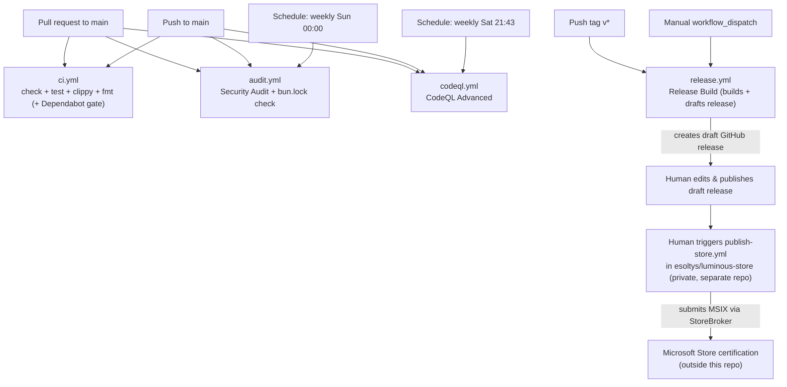

# CI/CD Pipeline

This documents the actual GitHub Actions pipeline as it exists in `.github/workflows/`.
There are four workflow files: `ci.yml`, `audit.yml`, `codeql.yml`, and `release.yml`.
`ci.yml` runs `bun run check` (svelte-check), `bun run test:run` (Vitest), `cargo test`,
`cargo clippy --all-targets -- -D warnings`, and `cargo fmt --check` on every PR — see below. The full local
pre-release re-run of these plus a manual QA pass still lives in
[`docs/RELEASE_CHECKLIST.md`](./RELEASE_CHECKLIST.md) as a belt-and-suspenders step before
cutting a release, not because CI skips them.

Microsoft Store submission is **not** part of this repo's pipeline — it lives in the
separate private repo `esoltys/luminous-store`, triggered manually against a published
`luminous` release tag. See that repo's `README.md` for details.

## What runs on pull requests (and pushes to `main`)

- **`ci.yml` — CI**
  - `frontend_check` job: `bun run check` (svelte-check + TypeScript, `--fail-on-warnings`)
    and `knip` (unused code/dependency detection).
  - `frontend_test` job: `bun run test:run` (Vitest).
  - `backend_test` job: `cargo test`, then `cargo clippy --all-targets -- -D warnings`
    (from `src-tauri/`) — any clippy warning fails the PR, not just errors.
  - `rust_fmt` job: `cargo fmt --check` (from `src-tauri/`). The pre-commit hook is opt-in
    per clone, so this is what stops formatting drift reaching `main`. No build needed.
  - `dependabot_regression_gate` job (Dependabot PRs only, `if: github.actor ==
    'dependabot[bot]'`): a real production build (`bun run build`), the Vitest suite
    against it, and `cargo test --locked` to catch a version bump that left `Cargo.lock`
    inconsistent — regressions `frontend_test`/`backend_test` don't reproduce on their own.
    Clippy isn't duplicated here since `backend_test` already covers every PR, Dependabot's
    included.

`audit.yml` and `codeql.yml` also trigger on `pull_request` and `push` targeting `main`,
plus a weekly `schedule`:

- **`audit.yml` — Security Audit**
  - `security_audit` job: runs `rustsec/audit-check@v2` against `Cargo.lock` to catch
    known-vulnerable Rust dependencies.
  - `lockfile_check` job: runs `bun install --frozen-lockfile` to fail if `bun.lock` has
    drifted from `package.json` (i.e. someone changed a dependency range without
    regenerating the lockfile), and runs `scripts/check-tauri-versions.ts` to ensure
    `@tauri-apps/*` npm packages and matching Rust crates in `Cargo.lock` have not drifted (#1208).
- **`codeql.yml` — CodeQL Advanced**
  - Runs GitHub's CodeQL static analysis across three language matrix legs: `actions`,
    `javascript-typescript`, and `rust` (all `build-mode: none`, i.e. CodeQL's own
    extraction rather than a real build — except Rust still runs `cargo check` first to
    generate code CodeQL can analyze).
  - Findings are uploaded to the repo's Security tab (`security-events: write`).

Both are also on a `schedule` (audit: weekly Sunday midnight; CodeQL: weekly Saturday
21:43 UTC), so they catch newly-disclosed vulnerabilities even without new commits.

## What runs on merge to `main`

Merging a PR to `main` is itself just a `push` to `main`, so it re-triggers `audit.yml`
and `codeql.yml` exactly as above. Nothing else fires automatically on merge — the actual
release build only happens when a `v*` tag is pushed (see below), which per
`RELEASE_CHECKLIST.md` is a separate, deliberate, manual step after the version-bump PR
merges.

## The release pipeline

### 1. `release.yml` — Release Build

Triggers: `push` of a tag matching `v*`, or manual `workflow_dispatch`. (An earlier
version of this workflow also listened for `release: published`, but neither job's `if:`
guard ever matched that event — it just produced a confusing no-op run every time a
release was published, so the trigger was removed.)

- **`create-release` job** (Linux only): determines the tag (from the ref, or from
  `package.json` version for manual dispatch), then creates a **draft** GitHub release for
  that tag via `gh release create ... --draft` (or reuses one if it already exists). This
  runs once, up front, so the matrix build below doesn't race to create duplicate drafts.
- **`release` job** (matrix: `ubuntu-24.04`, `windows-latest`), depends on `create-release`:
  - Installs deps with `bun install`, plus Linux system deps (webkit2gtk, ALSA, OpenSSL,
    appindicator, librsvg) on the Ubuntu leg.
  - Runs `tauri-apps/tauri-action@v0` (wrapped in `Wandalen/wretry.action@v3` for retry
    on transient failures) to build and sign the app, uploading artifacts into the draft
    release created above (`releaseDraft: true`).
  - On the Windows leg only: builds an MSIX package (`bun run tauri:windows:build`) and
    uploads it to the release assets via `softprops/action-gh-release@v2` (again with
    `draft: true` — the action would otherwise publish the release outright).

At the end of this workflow, the GitHub release exists as a **draft** with Linux + Windows
bundles (and MSIX) attached. It is not visible to end users yet.

### 2. Manual: publishing the draft release

Per `RELEASE_CHECKLIST.md`, a human edits the draft release body (replacing the
auto-generated notes with `docs/release-notes/vX.Y.Z.md`), optionally enables "Create a
discussion for this release," and clicks **Publish**. This is a manual GitHub UI action —
no workflow does it automatically.

### 3. Manual (separate repo): Microsoft Store submission

Once the release is published, Store submission is triggered by hand in
`esoltys/luminous-store` (private):

```bash
gh workflow run publish-store.yml -f tag=vX.Y.Z
```

That repo's `publish-store.yml` downloads the tag's `.msix`/`.msixbundle` asset from this
repo via `gh release download`, then runs Microsoft's StoreBroker PowerShell module to
submit it. See `esoltys/luminous-store`'s `README.md` for the full flow, including the
`-f update_screenshots=true` option for also replacing the live listing text/screenshots.
This repo (`luminous`) has no visibility into or dependency on that submission — it's
entirely decoupled, matching the previous in-repo `publish-store.yml`'s design (re-runnable
independently, doesn't gate or get gated by the build).

## Trigger graph



One thing worth calling out explicitly since it's easy to miss:

- Microsoft Store submission lives entirely in `esoltys/luminous-store`, not this repo. It's
  triggered by hand after a release is published, decoupled from `release.yml`, and can be
  re-run independently without touching this repo at all.

## Add-on themes

Optional add-on themes (epic #1036) are mostly outside this repo's pipeline:

- Building, signing, encrypting and publishing add-on bundles happens in the private
  `esoltys/luminous-store` repo, through its own manual `publish-addin.yml` workflow, and the
  key-release Worker is deployed from there too. Nothing in `luminous` triggers or waits on
  any of it, and `release.yml` never touches add-on bundles.
- The app's own add-on code (overlay runtime, Store entitlement, key cache, Settings section)
  is ordinary app code, so the normal `ci.yml` jobs above cover it: Vitest, `cargo test`,
  clippy and `cargo fmt --check`.
- CI cannot exercise the real purchase and key-release path. Dev builds have no package
  identity, so the Store is unavailable to them, and the path only runs in a packaged build
  installed from the Store. That is tested by hand on a package flight (see
  [`docs/PERMISSIONS.md`](./PERMISSIONS.md)).
